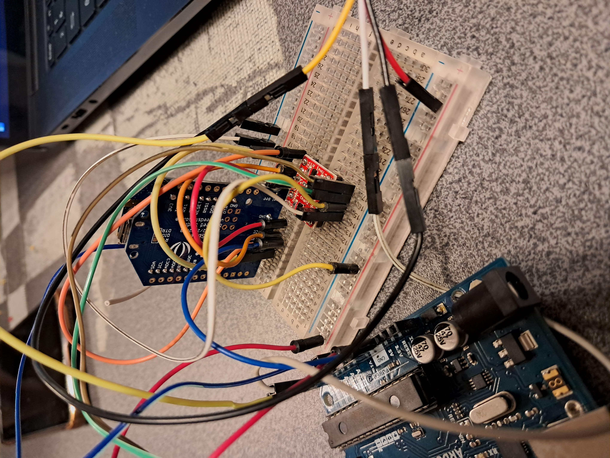
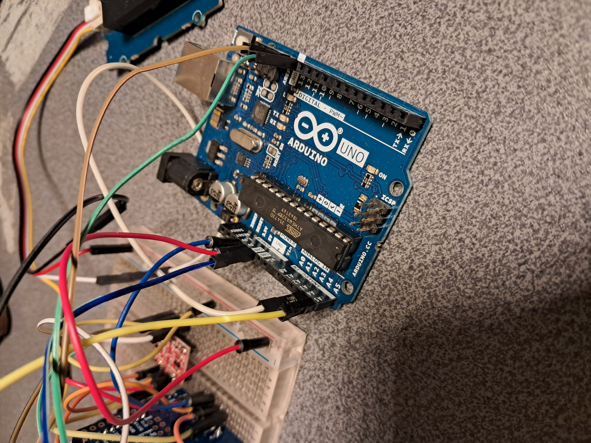
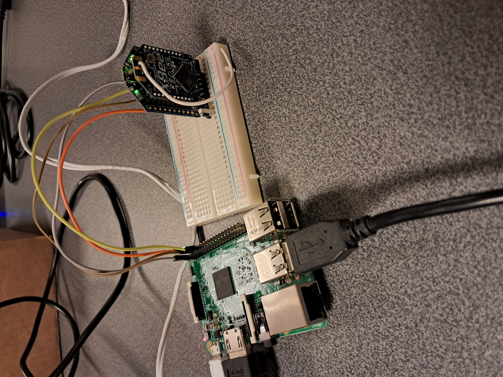
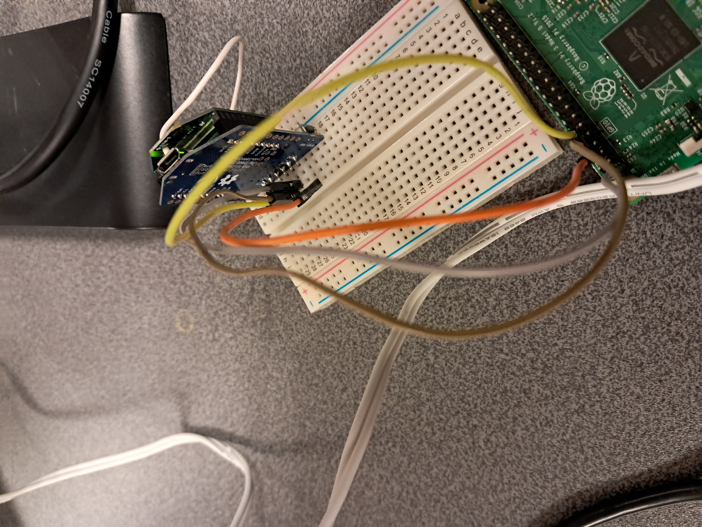
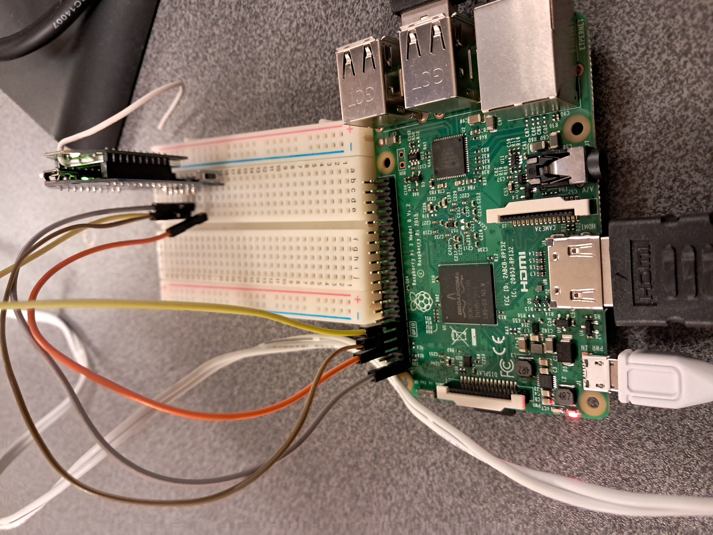
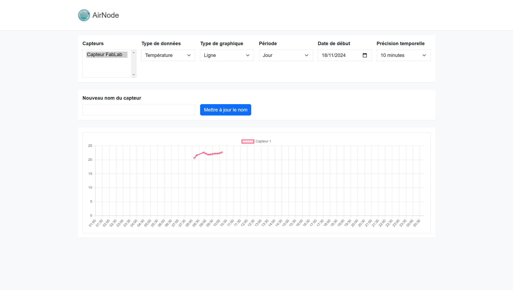
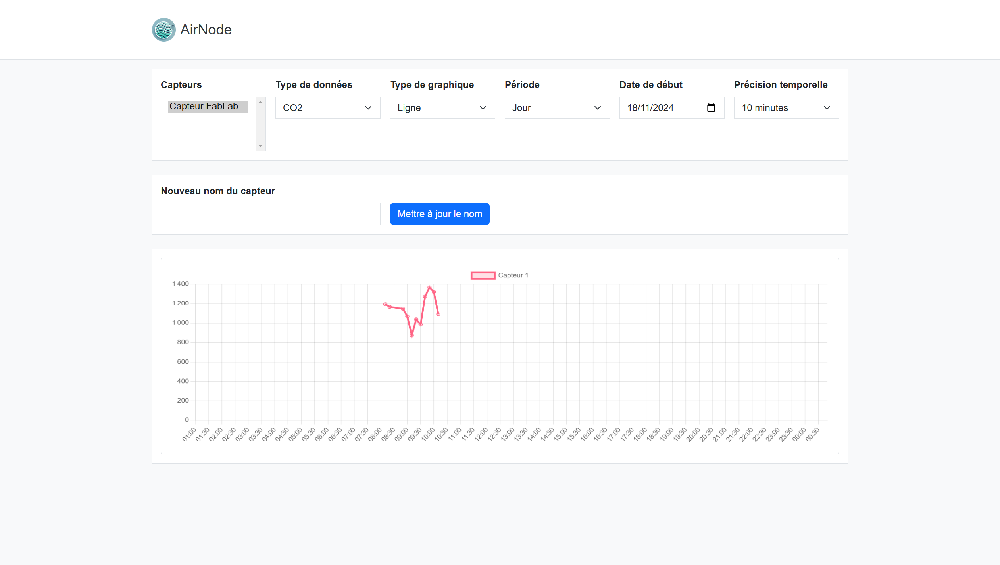

# AirNode - Projet de capteur de qualité de l'air

## 1) Brève description du projet
Le projet **AirNode** est un réseau de capteurs de qualité de l’air capable de mesurer la température, l’humidité et le taux de CO2 dans un environnement donné. Ces capteurs, appelés « nœuds », communiquent les données à une unité centrale via des modules XBee. L’unité centrale stocke les données dans une base SQLite et héberge une interface web permettant de visualiser les mesures en temps réel.

**Liste des membres de l’équipe :**
- Arthur Lenne

## 2) Problématique
La qualité de l’air est un enjeu crucial pour la santé, en particulier pour les personnes souffrant d’allergies, de problèmes respiratoires ou souhaitant tout simplement vivre dans un environnement sain. Cependant, il est souvent difficile d'obtenir des informations précises et en temps réel sur la qualité de l'air intérieur. Notre projet vise à répondre à cette problématique en proposant un système de capteurs connectés capable de mesurer et de visualiser des indicateurs tels que le taux de CO2, la température et l'humidité en temps réel. Ce dispositif permet aux utilisateurs de mieux comprendre leur environnement et d’agir pour améliorer leur qualité de vie.

## 3) Matériel utilisé et coût

#### Pour un module capteur de qualité d’air (~118,6 €) :
- Carte Arduino UNO : ~20 €
- Module UartSbee V5.0 : ~5 €
- Module Xbee Pro 51 (S5?) avec antenne : ~33,60 €
- Module SCD30 (capteur) : ~50 €
- Module SparkFun Logic Level Converter - 3.3V to 5V : ~5 €
- Breadboard : ~5 €
- Câbles : ~5 €

#### Pour l’unité centrale (~103,6 €) :
- Carte Raspberry Pi 3 : ~55 €
- Module UartSbee V5.0 : ~5 €
- Module Xbee Pro 51 (S5?) avec antenne : ~33,60 €
- Breadboard : ~5 €
- Câbles : ~5 €

#### Coût total : ~222,2 €

---

## 4) Scénario d’utilisation

#### Fonctionnement général
Le fonctionnement repose sur deux composants principaux : les capteurs **AirNode** et l’unité centrale.

Chaque capteur AirNode est équipé d'un capteur SCD30 capable de mesurer le taux de CO2, la température et l'humidité de l'air. Ces mesures sont réalisées toutes les dix secondes et transmises à l’unité centrale via un réseau XBee. Ce réseau utilise un mécanisme de meshing pour garantir une transmission résiliente et permettre une plus grande portée.

L'unité centrale, constituée d'une Raspberry Pi, reçoit ces données et les enregistre dans une base SQLite. Parallèlement, un serveur Flask hébergé sur l'unité centrale permet aux utilisateurs de consulter les mesures en temps réel via une interface web intuitive. Cette interface propose des graphiques dynamiques pour visualiser les tendances des différents indicateurs.

1. **AirNode - Capteur de qualité d’air**
   - Mesure les données de qualité de l’air (CO2, température, humidité) via un capteur SCD30.
   - Transmet ces données à l’unité centrale toutes les 5 secondes via le module XBee.

   - 
   - 
   - 

2. **AirNode - Unité centrale**
   - Reçoit les données grâce à un module XBee.
   - Stocke les données dans une base SQLite.
   - Héberge un site web Flask en Python permettant de visualiser les mesures en temps réel via des graphiques dynamiques.

   - 
   - 
   - 

#### Démonstration du site web
- **Interface web intuitive** : Permet de visualiser les mesures d'humidité, température et CO2 en temps réel.

---

### Bilan
Le projet **AirNode** répond en partie à la problématique initiale en offrant un moyen efficace d’analyser la qualité de l’air intérieur en temps réel. Les capteurs fournissent des mesures fiables pour le CO2, la température et l’humidité, et l’interface web facilite la compréhension et l’interprétation des données. Cependant, certains aspects pourraient être améliorés pour une expérience utilisateur plus complète.

---

### Continuité du projet

1. **Élargir les capacités de mesure** : Ajouter des capteurs d’allergènes comme le DSM501A pour détecter les particules fines.
2. **Automatiser les actions** : Contrôler des dispositifs connectés (purificateurs d’air, ventilateurs) en fonction des données collectées.
3. **Optimiser les coûts** : Utiliser des composants moins coûteux et améliorer l’intégration des capteurs.
4. **Simplifier la configuration** : Développer un module de configuration pour ajouter de nouveaux capteurs facilement.

Avec ces améliorations, **AirNode** pourrait devenir une solution complète et accessible pour améliorer la qualité de vie des utilisateurs.
